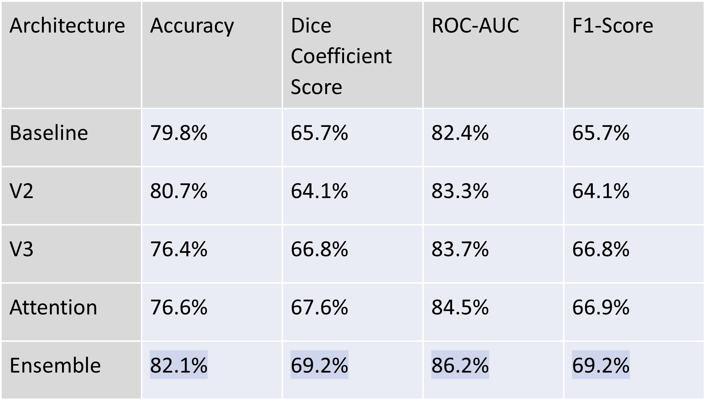

# Wildfire Spread Prediction with U-Net 

An investigation into using attention mechanisms for better feature extraction in wildfire spread prediction models. This research examines the U-net architecture to achieve image segmentation in wildfire spread prediction, a process that partitions images by predicting pixels that indicate positive wildfire locations. The deep learning models explored in this research integrate modern deep learning architectures, and techniques used to optimize them. The models are trained on 12 distinct observational variables derived from the Google Earth Engine catalog. Evaluation is conducted with accuracy, Dice coefficient score, ROC-AUC, and F1-score. This research concludes that when augmenting U-net with attention mechanisms, the attention component improves feature suppression and recognition, improving overall performance. Furthermore, employing ensemble modeling reduces bias and variation, leading to more consistent and accurate predictions. The architecture presented in this research achieved a ROC-AUC score of 86.2% and an accuracy of 82.1% when inferencing on wildfire propagation at 30-minute intervals. 


## Dependencies

```
pip install requirements.txt
```


## Data Export

1) Request access for Google Earth Engine
2) Setup Google Cloud Platform account
    - Create storage bucket
3) Link account with google auth CLI

Export dataset with the following command:

```
python3 -m data_export.export_ee_training_data_main \
--bucket=${BUCKET} \
--start_date="2020-01-01" \
--end_date="2021-01-01"
```

## Model Exploration and Training

Model exploration, testing, and analysis can be found in the model_training.ipynb


### Predictions Made by U-Net Variations


### Predictions Made by Ensemble Architecture


## Results




## Atribution

Data collection efforts are based on the paper ["Next Day Wildfire Spread: A Machine
Learning Data Set to Predict Wildfire Spreading from Remote-Sensing
Data"](http://arxiv.org/abs/2112.02447).

The dataset can be found on
[Kaggle](https://www.kaggle.com/fantineh/next-day-wildfire-spread).

F. Huot, R. L. Hu, N. Goyal, T. Sankar, M. Ihme, and Y.-F. Chen, “Next Day
Wildfire Spread: A Machine Learning Data Set to Predict Wildfire Spreading from
Remote-Sensing Data”, arXiv preprint, 2021.